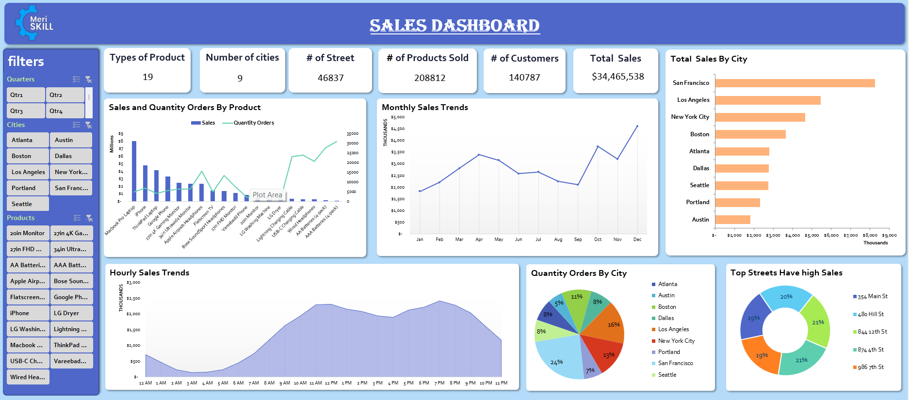

### Purpose: 
#### Analyze sales data to identify trends, top-selling products, and revenue metrics for business decision-making.

### Description: 
#### In this project, I will dive into a large sales dataset to extract valuable insights. I will explore sales trends over time, identify the best-selling products, calculate revenue metrics such as total sales and profit margins, and create visualizations to present your findings effectively. This project showcases My ability to manipulate and derive insights from large datasets, to make data-driven recommendations for optimizing sales strategies.

### Data Insights:
#### 1. Total - Sales is 34.49$M .  

#### 2. Number of Customer is 140.79K order

#### 3. December was the month with the highest sales (4.6$M ),followed by October ( 3.7$M).

#### 4. The time with highest number of orders is 11:58:00 AM , followedby 7:20:00 PM .

#### 5. The most orders were received during the time period from 10 AM to 8 PM.                            

